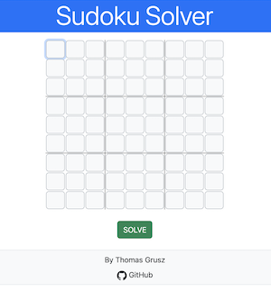

# Sudoku Solver - JavaScript Only

This project is a JavaScript-only port of another [Sudoku Solver project](https://github.com/thomasgrusz/Sudoku-Solver) that originally had a Python based backend. The purpose of this port is to simplify deployment by using a frontend only approach.

## Project Structure

- The `src/` folder contains all source files, including two Jupyter Notebooks I used to port the code from Python to JavaScript.
- The `docs/` folder contains minified files ready for deployment on GitHub ([gh-pages](https://docs.github.com/en/pages/getting-started-with-github-pages/creating-a-github-pages-site)).

## Task Runner: Gulp

To streamline the build and deployment process, this project uses the task runner **Gulp**. Gulp is responsible for copying and minifying the source files from `src/` into the distribution folder `docs/`. Gulp also ensures reasonable browser backwards compatibility for the JavaScript code via the `Babel` plugin.

## Development

Download the repo and `cd` into it. Then run the following command to set up your development environment and install Gulp and other necessary development dependencies:

`npm install`

(Note: Node.js and npm must be installed on your system.)

### Build and Watch

To create the production file bundle and automatically watch the src/ folder for changes, run the following command:

`npx gulp`

### Individual Gulp Tasks

You can also run specific Gulp tasks individually:

- `npx gulp clean` : Deletes the dist/ folder
- `npx gulp minifyHTML` : Minifies HTML files
- `npx gulp transpileJS` = transpileJS;
- `npx gulp copyStatic` : copy static files

## Solver Logic

The logic for solving Sudoku puzzles resides in `src/js/solver.js`. The code uses two distinct solving strategies

- elimination strategy
- only-choice strategy

and combines them using an approach called _constraint propagation_.
More details can be found in the comments in the code (lines 132 ff).
